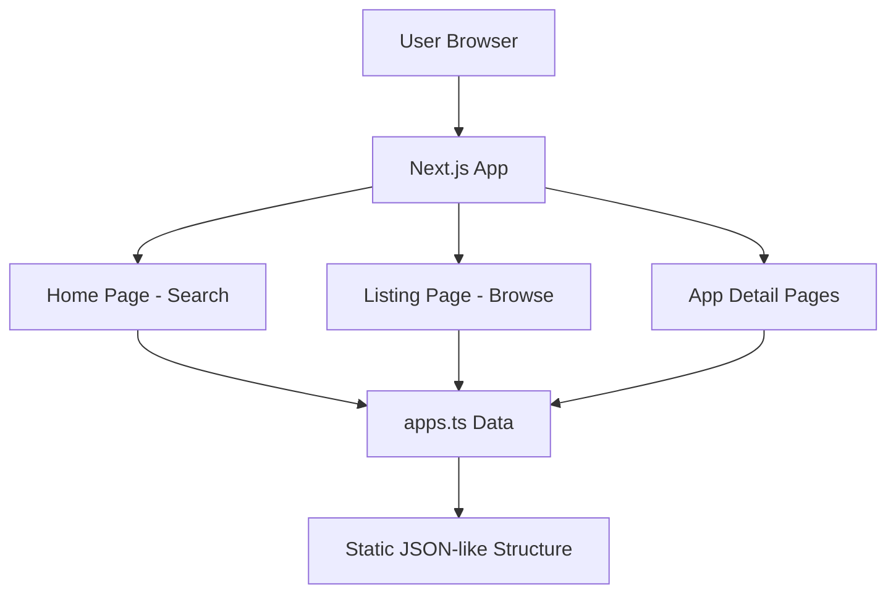

# BharatApps - System Architecture

## Architecture Overview

BharatApps follows a **Static Site Generation (SSG)** architecture using Next.js App Router. The application is entirely client-side with no backend services, making it fast, secure, and easy to deploy.



## Design Patterns

### 1. Static Data Pattern
**Pattern**: Compile-time data embedding
**Implementation**: All app data stored in `app/data/apps.ts` as a TypeScript constant
**Benefits**:
- Zero runtime database queries
- Type-safe data access
- Instant search performance
- No API latency

**Trade-offs**:
- Requires rebuild to update data
- Not suitable for user-generated content
- All data bundled in JavaScript

### 2. Client-Side Search Pattern
**Pattern**: In-memory filtering and indexing
**Implementation**: 
- Build foreign app → Indian alternatives map on component mount
- Use `useMemo` for optimized search filtering
- Real-time autocomplete with substring matching

**Code Example**:
```typescript
const foreignAppToIndianAlternatives: Record<string, typeof apps> = {};
apps.forEach(app => {
  app.alternatives.forEach(alt => {
    const lowerAlt = alt.toLowerCase();
    if (!foreignAppToIndianAlternatives[lowerAlt]) {
      foreignAppToIndianAlternatives[lowerAlt] = [];
    }
    foreignAppToIndianAlternatives[lowerAlt].push(app);
  });
});
```

### 3. Dynamic Routing Pattern
**Pattern**: File-system based routing with dynamic segments
**Implementation**: `app/app/[slug]/page.tsx` handles all app detail pages
**Benefits**:
- SEO-friendly URLs (e.g., `/app/zoho-crm`)
- Automatic route generation
- Type-safe params with TypeScript

### 4. CSS Modules Pattern
**Pattern**: Component-scoped styling
**Implementation**: Separate `.module.css` files for each page/component
**Benefits**:
- No style conflicts
- Better code organization
- Automatic class name hashing

## Data Flow

### Search Flow (Home Page)
```
User Input → State Update → useMemo Filter → Suggestions Array → Dropdown Render
     ↓
  Search Query (lowercase)
     ↓
  Filter uniqueForeignApps array
     ↓
  Match against foreignAppToIndianAlternatives map
     ↓
  Display grouped results with app cards
```

### Browse Flow (Listing Page)
```
User Input → State Update → useMemo Filter → Filtered Apps → Grid Render
     ↓
  Search Query
     ↓
  Filter apps array by name/description
     ↓
  Display app cards with alternatives
```

### Detail Page Flow
```
URL Slug → Params Promise → Find App → Render Details
     ↓
  Extract slug from URL
     ↓
  Search apps array for matching slug
     ↓
  Display full app information + similar apps
```

## Component Relationships

### Page Hierarchy
```
RootLayout (app/layout.tsx)
├── HomePage (app/page.tsx)
│   ├── Search Input
│   ├── Suggestions Dropdown
│   └── Benefits Section
├── ListingPage (app/listing/page.tsx)
│   ├── Search Input
│   └── Apps Grid
└── AppDetailsPage (app/app/[slug]/page.tsx)
    ├── App Header
    ├── Details Section
    ├── Alternatives List
    └── Similar Apps Grid
```

### State Management
**Approach**: React useState + useMemo (no external state library)
**Rationale**: Simple application with minimal state requirements

**State Locations**:
- `HomePage`: `searchQuery` (string)
- `ListingPage`: `searchQuery` (string)
- `AppDetailsPage`: `params` (object), `app` (object)

## Data Structure

### App Schema
```typescript
interface App {
  name: string;              // Display name
  slug: string;              // URL-friendly identifier
  description: string;       // Short description (1 line)
  description_long?: string; // Extended description
  category: string;          // Category slug
  website: string;           // Official website URL
  alternatives: string[];    // Foreign apps it replaces
  pricing: string;           // Pricing model
  company: string;           // Company name
  location: string;          // Company location
  image: string;             // Logo/icon URL
}
```

### Categories
- `business` - CRM, ERP, HR, Marketing tools
- `communication` - Messaging, video calls, collaboration
- `creative` - Design, video editing, content creation
- `development` - APIs, cloud, developer tools
- `e-commerce` - Online stores, marketplaces
- `education` - Learning platforms, LMS
- `entertainment` - Streaming, music, social video
- `finance` - Payments, accounting, fintech
- `hosting` - Domain, web hosting
- `productivity` - Office suites, note-taking, calendars
- `social-networking` - Social media platforms
- `travel` - Booking, ride-hailing
- `utilities` - Browsers, file transfer, maps

## Performance Considerations

### Optimization Strategies
1. **Static Generation**: All pages pre-rendered at build time
2. **Code Splitting**: Automatic route-based splitting by Next.js
3. **Memoization**: `useMemo` for expensive computations
4. **Image Optimization**: External images loaded on-demand
5. **CSS Modules**: Scoped styles prevent global pollution

### Performance Metrics
- **Initial Load**: < 2s (depends on network)
- **Search Response**: < 50ms (client-side filtering)
- **Page Navigation**: < 100ms (client-side routing)

## Security Considerations

### Current Security Posture
- **No Authentication**: Public read-only application
- **No User Input Storage**: All data is static
- **External Links**: Direct links to app websites (user discretion)
- **XSS Protection**: React's built-in escaping

### Potential Vulnerabilities
- **Malicious Links**: App website URLs not validated
- **Image Loading**: External images could track users
- **No CSP**: Content Security Policy not configured

### Recommendations for Agents
- Validate all URLs before adding to apps.ts
- Consider adding CSP headers in next.config.ts
- Implement image proxy for privacy
- Add rel="noopener noreferrer" to external links

## Deployment Architecture

### Vercel Deployment (Recommended)
```
GitHub Repository → Vercel Build → CDN Distribution → User Browser
       ↓
  Automatic builds on push
       ↓
  Static file generation
       ↓
  Global CDN deployment
```

### Build Process
1. `npm run build` - Next.js production build
2. Static HTML generation for all routes
3. JavaScript bundling and minification
4. CSS extraction and optimization
5. Asset optimization

### Environment Variables
**Current**: None required
**Future Considerations**:
- `NEXT_PUBLIC_ANALYTICS_ID` - Analytics tracking
- `NEXT_PUBLIC_API_URL` - If backend added

## Extension Points

### Adding New Apps
1. Add entry to `app/data/apps.ts`
2. Follow existing schema structure
3. Ensure slug is unique and URL-friendly
4. Rebuild and deploy

### Adding New Categories
1. Add category to app entries
2. Update category list in documentation
3. Consider adding category filtering UI

### Adding Backend (Future)
1. Create API routes in `app/api/`
2. Implement database connection
3. Add authentication middleware
4. Update data fetching logic

## Monitoring and Logging

### Current State
- **No Logging**: Client-side only, no server logs
- **No Analytics**: No tracking implemented
- **No Error Tracking**: No error reporting service

### Recommendations
- Add Vercel Analytics for basic metrics
- Implement error boundary for React errors
- Add console logging for debugging
- Consider Sentry for error tracking

## Testing Strategy

### Current Testing
- **None**: No automated tests implemented

### Recommended Testing Approach
1. **Unit Tests**: Test data filtering logic
2. **Component Tests**: Test search functionality
3. **E2E Tests**: Test user flows (search → detail)
4. **Visual Regression**: Test UI consistency

### Testing Tools to Consider
- Jest + React Testing Library (unit/component)
- Playwright or Cypress (E2E)
- Chromatic (visual regression)