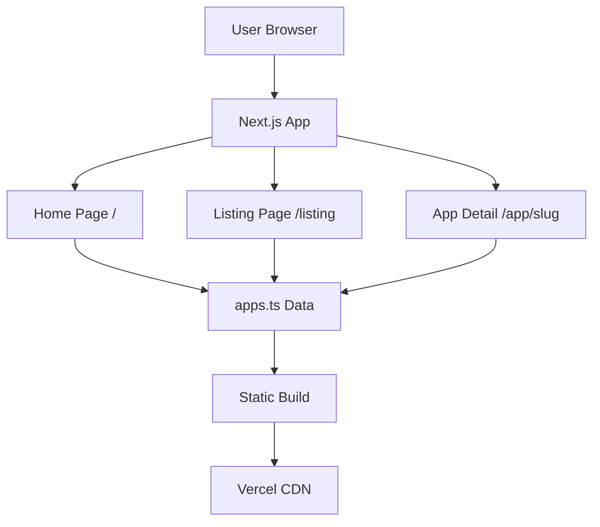

# System Architecture

## Architectural Overview

BharatApps follows a **Static Site Generation (SSG)** architecture using Next.js App Router. The application is entirely client-side rendered with no backend services, making it highly cacheable and performant.



## Component Architecture

### Page Components

#### 1. Home Page (`app/page.tsx`)
**Responsibility**: Primary search interface for finding Indian alternatives

**Key Features**:
- Foreign app search with autocomplete
- Real-time suggestion dropdown
- Reverse mapping from foreign apps to Indian alternatives
- Benefits section
- Navigation to listing page

**State Management**:
```typescript
const [searchQuery, setSearchQuery] = useState('');
const suggestions = useMemo(() => {
  if (!searchQuery) return [];
  const query = searchQuery.toLowerCase();
  return uniqueForeignApps
    .filter(app => app.includes(query))
    .slice(0, 8);
}, [searchQuery]);
```

**Data Processing**:
- Builds `foreignAppToIndianAlternatives` map on component mount
- Extracts unique foreign app names from all alternatives
- Performs case-insensitive filtering

#### 2. Listing Page (`app/listing/page.tsx`)
**Responsibility**: Browse and filter all Indian apps

**Key Features**:
- Grid display of all apps
- Search by Indian app name or description
- Category and alternative badges
- App count display

**State Management**:
```typescript
const [searchQuery, setSearchQuery] = useState('');
const searchFilteredApps = useMemo(() => {
  if (!searchQuery) return apps;
  const query = searchQuery.toLowerCase();
  return apps.filter(
    app => app.name.toLowerCase().includes(query) || 
           app.description.toLowerCase().includes(query)
  );
}, [searchQuery]);
```

#### 3. App Detail Page (`app/app/[slug]/page.tsx`)
**Responsibility**: Display comprehensive information about a specific app

**Key Features**:
- Dynamic route parameter handling
- App information display (image, name, category, company, location)
- Foreign alternatives list
- Similar apps recommendation (same category)
- Conditional navigation (back to home or listing based on referrer)

**Route Handling**:
```typescript
interface PageProps {
  params: Promise<{ slug: string }>;
}

// Async params handling for Next.js 15+
useEffect(() => {
  paramsPromise.then(p => {
    setParams(p);
    const foundApp = apps.find(a => a.slug === p.slug);
    setApp(foundApp || null);
  });
}, [paramsPromise]);
```

### Layout Component (`app/layout.tsx`)

**Responsibility**: Root layout with metadata and font configuration

**Key Elements**:
- SEO metadata (title, description, favicon)
- Google Fonts integration (Geist Sans, Geist Mono)
- Global CSS imports
- HTML structure

## Data Architecture

### Data Source: `app/data/apps.ts`

**Structure**: Single TypeScript file exporting array of 200+ app objects

**Schema**:
```typescript
export const apps = [
  {
    name: string,
    slug: string,
    description: string,
    description_long?: string,
    category: string,
    website: string,
    alternatives: string[],
    pricing: string,
    company: string,
    location: string,
    image: string
  },
  // ... 200+ more entries
];
```

**Data Characteristics**:
- **Size**: ~113KB (112,746 bytes)
- **Format**: TypeScript array literal
- **Validation**: Type-checked at compile time
- **Immutability**: Read-only at runtime

### Data Access Patterns

#### Pattern 1: Direct Import
```typescript
import { apps } from './data/apps';
// or
import { apps } from '@/app/data/apps';
```

#### Pattern 2: Filtering by Category
```typescript
const businessApps = apps.filter(app => app.category === 'business');
```

#### Pattern 3: Finding by Slug
```typescript
const app = apps.find(a => a.slug === slug);
```

#### Pattern 4: Reverse Mapping (Foreign → Indian)
```typescript
const foreignAppToIndianAlternatives: Record<string, typeof apps> = {};
apps.forEach(app => {
  app.alternatives.forEach(alt => {
    const lowerAlt = alt.toLowerCase();
    if (!foreignAppToIndianAlternatives[lowerAlt]) {
      foreignAppToIndianAlternatives[lowerAlt] = [];
    }
    foreignAppToIndianAlternatives[lowerAlt].push(app);
  });
});
```

## Styling Architecture

### CSS Modules Pattern

**Files**:
- `app/page.module.css` - Home page styles
- `app/listing.module.css` - Listing page styles
- `app/app-details.module.css` - App detail page styles
- `app/globals.css` - Global styles and resets

**Usage Pattern**:
```typescript
import styles from './page.module.css';

<div className={styles.container}>
  <h1 className={styles.title}>Title</h1>
</div>
```

**Benefits**:
- Scoped styles (no global namespace pollution)
- Type-safe class names (TypeScript autocomplete)
- Automatic dead code elimination
- No runtime CSS-in-JS overhead

### Inline Styles

Home page uses inline styles for dynamic gradient background and interactive hover effects:

```typescript
style={{
  background: 'linear-gradient(135deg, #ff8c00 0%, #ffffff 50%, #008000 100%)',
  padding: '4rem 2rem',
  minHeight: '100vh'
}}
```

**Rationale**: Enables dynamic styling without CSS module complexity for one-off styles.

## Routing Architecture

### Next.js App Router Structure

```
app/
├── page.tsx                 # Route: /
├── layout.tsx               # Root layout
├── globals.css              # Global styles
├── listing/
│   └── page.tsx            # Route: /listing
└── app/
    └── [slug]/
        └── page.tsx        # Route: /app/:slug
```

### Dynamic Routes

**Pattern**: File-based routing with dynamic segments

**Example**: `/app/[slug]/page.tsx`
- Matches: `/app/zoho-crm`, `/app/ola-cabs`, etc.
- Params: `{ slug: 'zoho-crm' }`

### Navigation Patterns

#### 1. Link Component (Client-Side)
```typescript
import Link from 'next/link';

<Link href="/listing">Browse All</Link>
<Link href={`/app/${app.slug}`}>{app.name}</Link>
```

#### 2. Query Parameters
```typescript
import { useSearchParams } from 'next/navigation';

const searchParams = useSearchParams();
const fromHome = searchParams.get('from') === 'home';
```

## Performance Optimizations

### 1. useMemo for Expensive Computations
```typescript
const suggestions = useMemo(() => {
  // Expensive filtering logic
}, [searchQuery]);
```

### 2. Lazy Image Loading
```typescript
 {
    e.currentTarget.style.display = 'none';
  }}
/>
```

### 3. Static Data (No API Calls)
- All data bundled at build time
- No runtime data fetching
- Instant page loads

### 4. CSS Modules (Build-Time Processing)
- Styles extracted and minified
- Critical CSS inlined
- Non-critical CSS lazy-loaded

## Security Considerations

### 1. No User Input Persistence
- Search queries not stored
- No cookies or local storage
- No user tracking

### 2. External Links
```typescript
<a href={app.website} target="_blank" rel="noopener noreferrer">
  Visit Website →
</a>
```
- `rel="noopener noreferrer"` prevents window.opener exploitation

### 3. Image Error Handling
```typescript
onError={(e) => {
  e.currentTarget.style.display = 'none';
}}
```
- Graceful degradation for broken image URLs

## Deployment Architecture

### Build Process
1. **TypeScript Compilation**: `.tsx` → `.js`
2. **CSS Processing**: Modules → Scoped CSS
3. **Static Generation**: Pages → HTML
4. **Asset Optimization**: Images, fonts minified
5. **Bundle Creation**: Client-side JavaScript chunks

### Vercel Deployment
- **Build Command**: `npm run build`
- **Output Directory**: `.next/`
- **Environment**: Node.js 20.x
- **CDN**: Automatic edge caching

### Static Export (Alternative)
```json
// next.config.ts
const nextConfig = {
  output: 'export'
};
```

Enables deployment to any static hosting (Netlify, GitHub Pages, S3).

## Error Handling

### 1. App Not Found
```typescript
if (!app) {
  return (
    <div className={styles.notFound}>
      <h1>App not found</h1>
      <Link href="/listing">← Back to Listing</Link>
    </div>
  );
}
```

### 2. Image Load Failures
```typescript
onError={(e) => {
  e.currentTarget.style.display = 'none';
}}
```

### 3. Empty Search Results
```typescript
{searchFilteredApps.length === 0 ? (
  <div className={styles.emptyState}>
    <p>No apps found. Try a different search.</p>
  </div>
) : (
  // Render apps
)}
```

## Scalability Considerations

### Current Limitations
- **Data Size**: 200+ apps manageable, but 1000+ would impact bundle size
- **Search Performance**: O(n) linear scan acceptable for current size
- **Memory**: All data loaded in memory (not an issue for static data)

### Scaling Strategies

#### 1. Code Splitting
```typescript
const apps = await import('./data/apps');
```

#### 2. Pagination
```typescript
const paginatedApps = apps.slice(page * pageSize, (page + 1) * pageSize);
```

#### 3. Virtual Scrolling
For large lists, implement windowing (react-window, react-virtualized).

#### 4. Search Index
For 1000+ apps, implement client-side search index (Fuse.js, FlexSearch).