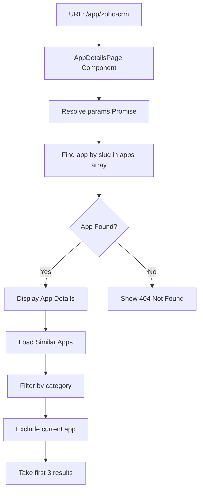

# App Details Feature

## Purpose & Responsibility
The app details page displays comprehensive information about a single Indian application, including its description, pricing, company details, foreign alternatives it replaces, and similar Indian apps in the same category.

## Location
- **File**: `app/app/[slug]/page.tsx`
- **Route**: `/app/[slug]` (dynamic route)
- **Styling**: `app/app-details.module.css`

## Technical Architecture

### Component Structure
```typescript
interface PageProps {
  params: Promise<{ slug: string }>;
}

export default function AppDetailsPage({ params: paramsPromise }: PageProps)
```

### Key Features
1. **Dynamic Routing**: Uses Next.js dynamic segments `[slug]`
2. **Async Params**: Handles params as Promise (Next.js 15+ pattern)
3. **Client-Side Rendering**: Marked with `'use client'` directive
4. **Navigation Context**: Tracks if user came from home or listing page
5. **Similar Apps**: Shows 3 related apps from same category

## Data Flow



## Implementation Details

### State Management
```typescript
const [params, setParams] = useState<{ slug: string } | null>(null);
const [app, setApp] = useState<typeof apps[0] | null>(null);
```

### App Lookup Logic
```typescript
useEffect(() => {
  paramsPromise.then(p => {
    setParams(p);
    const foundApp = apps.find(a => a.slug === p.slug);
    setApp(foundApp || null);
  });
}, [paramsPromise]);
```

### Navigation Context Detection
```typescript
const searchParams = useSearchParams();
const fromHome = searchParams.get('from') === 'home';
const backLink = fromHome ? '/' : '/listing';
const backText = fromHome ? '← Back to Home' : '← Back to Listing';
```

## Page Sections

### 1. Top Navigation
- Conditional home button (hidden if coming from home)
- Context-aware back button
- Breadcrumb-style navigation

### 2. Header Section
- App logo/image (with fallback to first letter)
- App name (h1)
- Category badge
- Company name
- Website link with external indicator

### 3. Overview Section
- Short description
- Long description (if available)
- Formatted text with proper spacing

### 4. Details Grid
- **Pricing Model**: Free, Freemium, or Paid
- **Company**: Organization name
- **Location**: City/State in India
- **Category**: Functional category

### 5. Foreign Alternatives Section
- List of foreign apps this replaces
- Globe icon for each alternative
- Formatted as badge-style items

### 6. Benefits Section
- Standard benefits of choosing Indian apps
- Bullet points highlighting advantages
- Emphasis on local support and compliance

### 7. Similar Apps Section
- 3 apps from same category
- Clickable cards with images
- Excludes current app from results

## Error Handling

### App Not Found
```typescript
if (!params || !app) {
  return (
    <main className={styles.main}>
      <div className={styles.notFound}>
        <h1>App not found</h1>
        <p>The app you're looking for doesn't exist.</p>
        <Link href="/listing">← Back to Listing</Link>
      </div>
    </main>
  );
}
```

### Image Loading Errors
- Fallback to placeholder with first letter
- Graceful degradation for missing images
- Consistent visual experience

## Styling Approach

### CSS Modules
- Scoped styles via `app-details.module.css`
- Prevents style conflicts
- Component-specific class names

### Key Style Classes
- `.main`: Page container
- `.header`: App header section
- `.imageSection`: Logo container
- `.titleSection`: Name and metadata
- `.content`: Main content area
- `.section`: Content sections
- `.detailsGrid`: 2-column grid for details
- `.alternativesList`: Foreign apps list
- `.similarApps`: Related apps section

## Extension Points

### Adding New Sections
1. Create new section in `.content` div
2. Add corresponding CSS class
3. Follow existing section structure

### Customizing Similar Apps Logic
```typescript
// Current: Filter by category, exclude current, take 3
apps
  .filter(a => a.category === app.category && a.slug !== app.slug)
  .slice(0, 3)

// Can be extended to:
// - Sort by relevance score
// - Include apps with overlapping alternatives
// - Prioritize apps from same company
```

### Adding User Interactions
- Rating system
- Review submission
- Bookmark/favorite functionality
- Share buttons
- Report incorrect information

## Performance Considerations

### Client-Side Rendering
- Fast initial load (static HTML)
- Hydration for interactivity
- No server round-trips

### Image Optimization
- Use Next.js Image component for optimization
- Lazy loading for similar apps
- Proper alt text for accessibility

### Data Fetching
- No API calls (static data)
- Instant app lookup
- No loading states needed

## SEO Considerations

### Current Limitations
- Client-side rendering limits SEO
- No dynamic metadata per app
- Search engines may not index properly

### Recommended Improvements
```typescript
// Add generateMetadata function
export async function generateMetadata({ params }: PageProps): Promise<Metadata> {
  const { slug } = await params;
  const app = apps.find(a => a.slug === slug);
  
  return {
    title: `${app?.name} - Indian Alternative | BharatApps`,
    description: app?.description,
    openGraph: {
      images: [app?.image],
    },
  };
}
```

## Testing Scenarios

1. **Valid App Slug**: Verify correct app details display
2. **Invalid Slug**: Confirm 404 page shows
3. **Navigation Context**: Test back button from home vs listing
4. **Missing Images**: Verify fallback placeholder works
5. **Similar Apps**: Confirm correct filtering and display
6. **External Links**: Ensure website links open in new tab
7. **Responsive Design**: Test on mobile, tablet, desktop

## Common Modifications

### Adding a New Detail Field
```typescript
// 1. Update apps.ts schema
// 2. Add to details grid
<div className={styles.detailItem}>
  <strong>New Field</strong>
  <p>{app.newField}</p>
</div>
```

### Changing Similar Apps Count
```typescript
// Change .slice(0, 3) to desired number
.slice(0, 6) // Show 6 similar apps
```

### Customizing Back Navigation
```typescript
// Add more navigation contexts
const fromSearch = searchParams.get('from') === 'search';
const fromCategory = searchParams.get('from') === 'category';
```

## Accessibility

- Semantic HTML structure (h1, h2, sections)
- Alt text for images
- Keyboard navigation support
- Focus management for links
- ARIA labels where appropriate

## Known Limitations

1. **No Server-Side Rendering**: Limits SEO and initial load performance
2. **Static Similar Apps**: No personalization or relevance scoring
3. **No Analytics**: Can't track which apps are most viewed
4. **No User Feedback**: No way to report errors or suggest improvements
5. **Image Hosting**: Relies on external image URLs (can break)