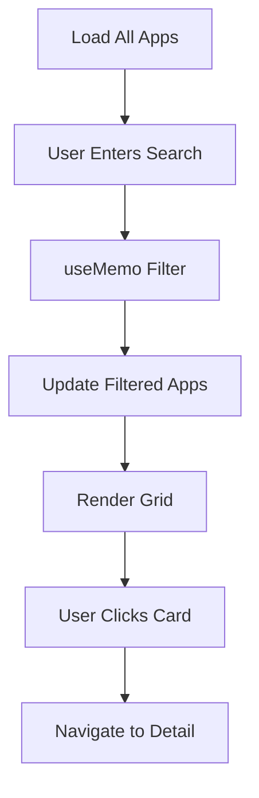

# App Listing Page

## Purpose & Responsibility
The listing page provides a comprehensive browsable catalog of all Indian apps in the database. It enables users to explore the full collection with search and filtering capabilities, organized by categories and alternatives.

## Location
`app/listing/page.tsx`

## Technical Architecture

### Component Structure
```typescript
ListingPage (Client Component)
├── Home Button (Navigation)
├── Header Section
├── Search Box
├── Stats Display (App Count)
└── Apps Grid
    └── App Cards (Link Components)
```

### Key Features
1. **Full Catalog Display**: Shows all 200+ apps in grid layout
2. **Real-time Search**: Filter by app name or description
3. **Category Badges**: Visual category identification
4. **Alternative Tags**: Shows foreign apps being replaced
5. **Responsive Grid**: Adapts to screen size

## Data Flow



## Implementation Details

### Search Filter Logic
```typescript
const searchFilteredApps = useMemo(() => {
  if (!searchQuery) return apps;
  const query = searchQuery.toLowerCase();
  return apps.filter(
    app => app.name.toLowerCase().includes(query) || 
           app.description.toLowerCase().includes(query)
  );
}, [searchQuery]);
```

**Search Behavior:**
- Searches both app name and description
- Case-insensitive matching
- Substring match (not exact match)
- No minimum query length
- Instant results (no debouncing)

### State Management

#### Local State
- `searchQuery`: Current search input value (string)

#### Derived State
- `searchFilteredApps`: Computed filtered app list (useMemo)

### Grid Layout

**CSS Module**: `listing.module.css`

```css
.appsGrid {
  display: grid;
  grid-template-columns: repeat(auto-fill, minmax(300px, 1fr));
  gap: 1.5rem;
}
```

**Responsive Behavior:**
- Auto-fills columns based on available width
- Minimum card width: 300px
- Equal-width columns
- 1.5rem gap between cards

### App Card Structure

```typescript
<Link href={`/app/${app.slug}`} className={styles.appCard}>
  <div className={styles.appImage}>
    {app.image ? (
      
    ) : (
      <div className={styles.placeholder}>{app.name.charAt(0)}</div>
    )}
  </div>
  <div className={styles.appContent}>
    <h3>{app.name}</h3>
    <p className={styles.category}>{app.category}</p>
    <p className={styles.description}>{app.description}</p>
    <div className={styles.alternativesList}>
      <strong>Alternatives:</strong>
      <div className={styles.alternatives}>
        {app.alternatives.slice(0, 2).map(alt => (
          <span key={alt} className={styles.alt}>{alt}</span>
        ))}
        {app.alternatives.length > 2 && (
          <span className={styles.altMore}>+{app.alternatives.length - 2}</span>
        )}
      </div>
    </div>
  </div>
</Link>
```

**Card Components:**
1. **Image/Placeholder**: App logo or first letter
2. **Title**: App name (h3)
3. **Category Badge**: Functional category
4. **Description**: Brief app description
5. **Alternatives**: Up to 2 foreign apps + count

## User Interactions

### Search Input
1. User types in search box
2. `onChange` updates `searchQuery` state
3. `useMemo` recalculates filtered apps
4. Grid re-renders with filtered results
5. Stats update to show filtered count

### Card Click
- Navigates to `/app/{slug}`
- No query parameters (different from home page)
- Entire card is clickable (Link wrapper)

### Home Button
- Returns to home page (`/`)
- Fixed position in top-left

## Styling Approach

### CSS Modules
**File**: `app/listing.module.css`

Used for:
- Grid layout
- Card styling
- Search container
- Header and stats
- Responsive breakpoints

### Key Style Classes
```css
.main - Page container
.header - Title and description
.searchContainer - Search input wrapper
.searchBox - Search input styling
.stats - App count display
.appsGrid - Grid layout
.appCard - Individual card
.appImage - Image container
.placeholder - Fallback for missing images
.appContent - Card text content
.category - Category badge
.description - App description
.alternativesList - Alternatives section
.alternatives - Alternative tags container
.alt - Individual alternative tag
.altMore - "+N more" indicator
.emptyState - No results message
.homeButton - Navigation button
```

## Extension Points

### Adding Category Filters
```typescript
const [selectedCategory, setSelectedCategory] = useState<string | null>(null);

const filteredApps = useMemo(() => {
  let result = apps;
  
  // Category filter
  if (selectedCategory) {
    result = result.filter(app => app.category === selectedCategory);
  }
  
  // Search filter
  if (searchQuery) {
    const query = searchQuery.toLowerCase();
    result = result.filter(
      app => app.name.toLowerCase().includes(query) || 
             app.description.toLowerCase().includes(query)
    );
  }
  
  return result;
}, [searchQuery, selectedCategory]);
```

### Adding Sort Options
```typescript
const [sortBy, setSortBy] = useState<'name' | 'category'>('name');

const sortedApps = useMemo(() => {
  const filtered = searchFilteredApps;
  return [...filtered].sort((a, b) => {
    if (sortBy === 'name') {
      return a.name.localeCompare(b.name);
    }
    return a.category.localeCompare(b.category);
  });
}, [searchFilteredApps, sortBy]);
```

### Adding Pagination
```typescript
const [page, setPage] = useState(1);
const ITEMS_PER_PAGE = 20;

const paginatedApps = useMemo(() => {
  const start = (page - 1) * ITEMS_PER_PAGE;
  const end = start + ITEMS_PER_PAGE;
  return searchFilteredApps.slice(start, end);
}, [searchFilteredApps, page]);
```

## Common Modification Patterns

### Changing Grid Columns
```css
/* Current: Auto-fill with 300px minimum */
grid-template-columns: repeat(auto-fill, minmax(300px, 1fr));

/* Fixed 3 columns */
grid-template-columns: repeat(3, 1fr);

/* Responsive breakpoints */
@media (max-width: 768px) {
  grid-template-columns: 1fr;
}
@media (min-width: 769px) and (max-width: 1024px) {
  grid-template-columns: repeat(2, 1fr);
}
@media (min-width: 1025px) {
  grid-template-columns: repeat(3, 1fr);
}
```

### Customizing Alternative Display
```typescript
// Current: Shows 2 alternatives + count
app.alternatives.slice(0, 2)

// Show 3 alternatives
app.alternatives.slice(0, 3)

// Show all alternatives
app.alternatives.map(alt => ...)
```

### Adding Loading State
```typescript
const [isLoading, setIsLoading] = useState(true);

useEffect(() => {
  // Simulate data loading
  setTimeout(() => setIsLoading(false), 100);
}, []);

if (isLoading) {
  return <div>Loading apps...</div>;
}
```

## Performance Optimization

### Current Optimizations
1. **useMemo for filtering**: Prevents unnecessary recalculations
2. **CSS Grid**: Hardware-accelerated layout
3. **Image lazy loading**: Browser-native lazy loading

### Potential Improvements
1. **Virtual Scrolling**: Render only visible cards
2. **Pagination**: Load apps in chunks
3. **Image Optimization**: Use Next.js Image component
4. **Debounced Search**: Add 200ms delay
5. **Memoized Cards**: Wrap cards in React.memo

## Testing Considerations

### Key Test Scenarios
1. All apps display correctly on initial load
2. Search filters apps by name
3. Search filters apps by description
4. Empty search shows all apps
5. No results shows empty state
6. Stats display correct count
7. Card click navigates to detail page
8. Home button returns to home page
9. Images load correctly
10. Placeholder shows for missing images

### Edge Cases
1. App with no image
2. App with very long name
3. App with very long description
4. App with no alternatives
5. App with many alternatives (10+)
6. Search with special characters
7. Search with no results

## Accessibility

### Current Implementation
- Semantic HTML (h1, h3, p)
- Alt text for images
- Keyboard-accessible links
- Focus states on interactive elements

### Improvements Needed
1. ARIA label for search input
2. ARIA live region for results count
3. Skip to content link
4. Focus management after search
5. Keyboard shortcuts (e.g., / to focus search)

## Known Limitations

1. **No Category Filters**: Can't filter by category
2. **No Sort Options**: Fixed alphabetical order
3. **No Pagination**: All apps load at once
4. **No Favorites**: Can't save favorite apps
5. **No Comparison**: Can't compare multiple apps
6. **Limited Search**: Only name and description

## Integration Points

### Dependencies
- `next/link`: Navigation to app details
- `react`: useState, useMemo hooks
- `../data/apps`: Static app database
- `../listing.module.css`: Component styles

### Navigation
- Links to `/` (Home)
- Links to `/app/[slug]` (App Details)

## Monitoring & Logging

Currently no monitoring implemented. Recommended additions:

1. **Usage Analytics**
   - Track search queries
   - Monitor popular apps (clicks)
   - Measure time on page

2. **Performance Metrics**
   - Page load time
   - Search response time
   - Grid render time

3. **Error Tracking**
   - Failed image loads
   - Navigation errors
   - Search errors