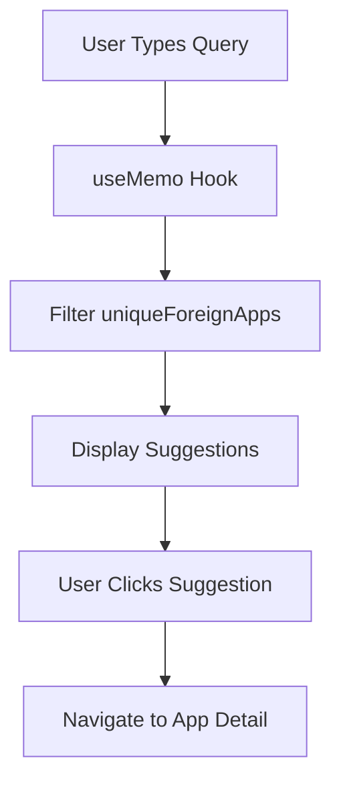

# Home Page - Search Interface

## Purpose & Responsibility
The home page serves as the primary entry point for users to discover Indian app alternatives by searching for foreign app names. It provides an intuitive search experience with real-time suggestions and direct navigation to Indian alternatives.

## Location
`app/page.tsx`

## Technical Architecture

### Component Structure
```typescript
HomePage (Client Component)
├── Search Input with Autocomplete
├── Suggestions Dropdown
│   ├── Foreign App Groups
│   └── Indian App Cards
├── Browse All Button
└── Benefits Section
```

### Key Features
1. **Real-time Search**: Client-side filtering with useMemo optimization
2. **Autocomplete Suggestions**: Shows up to 8 matching foreign apps
3. **Grouped Results**: Indian alternatives grouped by foreign app
4. **Visual Cards**: App logos, names, and quick links
5. **Responsive Design**: Mobile-first approach with gradient background

## Data Flow



## Implementation Details

### Search Algorithm
```typescript
const suggestions = useMemo(() => {
  if (!searchQuery) return [];
  const query = searchQuery.toLowerCase();
  return uniqueForeignApps
    .filter(app => app.includes(query))
    .slice(0, 8);
}, [searchQuery]);
```

**Performance Considerations:**
- Uses `useMemo` to prevent unnecessary recalculations
- Limits results to 8 items for optimal UX
- Case-insensitive matching for better user experience

### Foreign App to Indian Alternatives Mapping
```typescript
const foreignAppToIndianAlternatives: Record<string, typeof apps> = {};
apps.forEach(app => {
  app.alternatives.forEach(alt => {
    const lowerAlt = alt.toLowerCase();
    if (!foreignAppToIndianAlternatives[lowerAlt]) {
      foreignAppToIndianAlternatives[lowerAlt] = [];
    }
    foreignAppToIndianAlternatives[lowerAlt].push(app);
  });
});
```

**Key Points:**
- Built at component initialization (not on every render)
- Lowercase keys for case-insensitive lookup
- Supports multiple Indian apps per foreign alternative

### Unique Foreign Apps List
```typescript
const uniqueForeignApps = Array.from(
  new Set(apps.flatMap(app => app.alternatives.map(alt => alt.toLowerCase())))
).sort();
```

**Purpose:**
- Extracts all unique foreign app names from the database
- Sorted alphabetically for consistent ordering
- Used as the search corpus

## State Management

### Local State
- `searchQuery`: Current search input value
- `suggestions`: Computed list of matching foreign apps
- `showSuggestions`: Boolean flag for dropdown visibility

### Derived State
- `uniqueForeignApps`: Computed once at component mount
- `foreignAppToIndianAlternatives`: Computed once at component mount

## User Interactions

### Search Input
1. User types in search box
2. `onChange` updates `searchQuery` state
3. `useMemo` recalculates suggestions
4. Dropdown appears if matches found

### Clear Button
- Appears when search query is not empty
- Resets `searchQuery` to empty string
- Hides suggestions dropdown

### Suggestion Click
- Navigates to `/app/{slug}?from=home`
- Query parameter tracks navigation source
- Preserves user context for back navigation

## Styling Approach

### Inline Styles
Used for:
- Layout and positioning
- Colors and gradients
- Interactive states (hover, focus)
- Responsive behavior

### CSS Modules
Not used on home page (all inline styles)

### Design Tokens
```typescript
Colors:
- Primary: #2563eb (blue)
- Background: linear-gradient(135deg, #ff8c00 0%, #ffffff 50%, #008000 100%)
- Text: #0f172a (dark), #64748b (gray), #94a3b8 (light gray)
- Border: #e2e8f0

Spacing:
- Container max-width: 900px
- Section padding: 2rem
- Card padding: 1rem - 2rem

Typography:
- Font family: -apple-system, BlinkMacSystemFont, "Segoe UI", Roboto
- Heading: 1.3rem - 1.5rem
- Body: 1rem - 1.25rem
```

## Extension Points

### Adding New Search Features
1. **Fuzzy Search**: Implement Levenshtein distance for typo tolerance
2. **Search History**: Store recent searches in localStorage
3. **Popular Searches**: Display trending foreign apps
4. **Category Filters**: Add category chips to refine results

### Enhancing Suggestions
1. **Rich Previews**: Show app descriptions in dropdown
2. **Keyboard Navigation**: Arrow keys to navigate suggestions
3. **Search Analytics**: Track popular search terms
4. **Voice Search**: Add speech-to-text input

## Common Modification Patterns

### Changing Suggestion Limit
```typescript
// Current: 8 suggestions
.slice(0, 8)

// Change to 12
.slice(0, 12)
```

### Adding Search Filters
```typescript
const suggestions = useMemo(() => {
  if (!searchQuery) return [];
  const query = searchQuery.toLowerCase();
  return uniqueForeignApps
    .filter(app => {
      // Add category filter
      if (selectedCategory && !app.category.includes(selectedCategory)) {
        return false;
      }
      return app.includes(query);
    })
    .slice(0, 8);
}, [searchQuery, selectedCategory]);
```

### Customizing Suggestion Display
```typescript
// Current: Shows app name only
<span style={{ flex: 1 }}>{app.name}</span>

// Add category badge
<span style={{ flex: 1 }}>
  {app.name}
  <span style={{ fontSize: '0.8rem', color: '#64748b' }}>
    {app.category}
  </span>
</span>
```

## Performance Optimization

### Current Optimizations
1. **useMemo for suggestions**: Prevents recalculation on every render
2. **Slice results**: Limits DOM nodes for better performance
3. **Lowercase comparison**: Single transformation, cached

### Potential Improvements
1. **Debounced Search**: Add 200ms delay before filtering
2. **Virtual Scrolling**: For large suggestion lists
3. **Web Workers**: Offload search to background thread
4. **Index-based Search**: Pre-build search index for faster lookups

## Testing Considerations

### Key Test Scenarios
1. Empty search query shows no suggestions
2. Partial match returns correct foreign apps
3. Case-insensitive search works correctly
4. Clicking suggestion navigates to correct page
5. Clear button resets search state
6. Suggestion limit enforced (max 8)
7. Duplicate Indian apps are deduplicated

### Edge Cases
1. Foreign app with no Indian alternatives
2. Search query with special characters
3. Very long search queries
4. Rapid typing (state updates)

## Accessibility

### Current Implementation
- Semantic HTML structure
- Keyboard-accessible clear button
- Focus states on interactive elements

### Improvements Needed
1. ARIA labels for search input
2. ARIA live region for suggestions
3. Keyboard navigation for dropdown
4. Screen reader announcements
5. Focus management on suggestion selection

## Known Limitations

1. **No Fuzzy Matching**: Exact substring match only
2. **No Search History**: Users can't see previous searches
3. **No Analytics**: Can't track popular searches
4. **Limited Suggestions**: Only 8 results shown
5. **No Keyboard Navigation**: Must use mouse to select suggestions

## Integration Points

### Dependencies
- `next/link`: Navigation to app detail pages
- `react`: useState, useMemo hooks
- `./data/apps`: Static app database

### Navigation
- Links to `/listing` (Browse All)
- Links to `/app/[slug]` (App Details)
- Query parameter `?from=home` for tracking

## Monitoring & Logging

Currently no monitoring implemented. Recommended additions:

1. **Search Analytics**
   - Track search queries
   - Monitor suggestion click-through rates
   - Identify popular foreign apps

2. **Performance Metrics**
   - Search response time
   - Suggestion rendering time
   - Component mount time

3. **Error Tracking**
   - Failed image loads
   - Navigation errors
   - State update errors